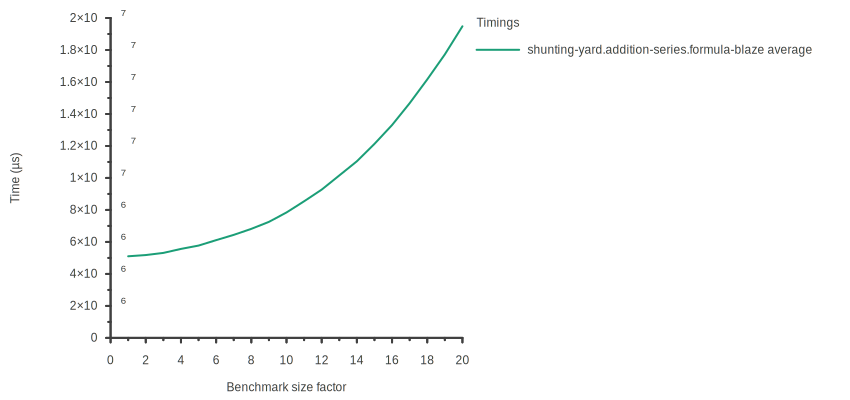

<!-- paginate: skip -->

<br/>
<br/>

# Techniques avancées de génération de code pour la performance

<br/>

> Jules Pénuchot

<br/>

**Université Paris-Saclay**
*Equipe ParSys*

Thèse sous la direction de *Joël Falcou*
Soutenue le 24/09/2024 à l'Université Paris-Saclay

---
<!-- paginate: true -->

## Le HPC: un paysage de plus en plus complexe

**Le matériel:**

- Plus de *parallélisme(s)*: CPUs multi-coeurs, SIMD, GPUs
  Exemples: AMD EPYC, Fujitsu A64FX

- Plus de *spécialisation*: TPU, FPGA
  Exemples: Cerebras WSE-3

**Bibliothèques, langages, et applications:**

- Une compatibilité de plus en plus *large*

- Des domaines de plus en plus *diversifiés*

*Comment assurer la portabilité et la pérennité du code haute performance ?*

---

## Le millefeuille d'abstractions du HPC en C++

<br/>


<!-- https://ivanceras.github.io/svgbob-editor/

.--------------------------.
| "Haut niveau: Intention" |
'--------------------------'

  ^ "Bibliothèques expressives, DSELs: Blaze, Eigen..."
  |
  | "Bibliothèques HPC: BLAS, CUBS, cuDNN, EVE, Thrust, LAPACK..."
  |
  | "Primitives, extensions, APIs: Fonctions intrinsèques, noyaux GPU, OpenMP..."
  |
  v "Instructions CPU/GPU: ARM, x86, RISC-V, PTX..."

.------------------------.
| "Bas niveau: Matériel" |
'------------------------'
-->

---

## Concilier abstraction et performance

- Des abstractions **à forte capacité d'adaptation**:

  - Differents jeux d'instructions

  - Différents paramètres de tuning (taille de cache, etc.)

  - Différents types de processeurs (CPU/GPU)

- Des abstractions **performantes**:

  - Autant que possible, **résolues à la compilation**

<br/>

**Pour ces raisons, on se tourne vers la métaprogrammation**

---

## La métaprogrammation pour la performance

- **Métaprogramme:** programme consommant et/ou générant du code.

  - Exemples: LISP, C, Rust, Haskell, MetaOCaml, etc...

- En C++, les bibliothèques HPC utilisent très majoritairement
  **la métaprogrammation de templates**

  - **Principe:** utiliser les types pour effectuer des calculs à la compilation
  - **Intérêts:** évaluation partielle, composabilité, nouvelles abstractions
  - **Exemples:** Thrust, EVE, HPX
<br/>

*Peut-on aller plus haut en niveau d'abstraction ?*
**Oui, via les Domain Specific Embedded Languages**

---

## Les Domain Specific Embedded Languages (DSELs)

- En C++, les langages dédiés embarqués utilisent la **surcharge d'opérateurs**
  et les **expression templates** pour la génération de code.

- **Expression templates:** représentation d'expressions algébriques
  sous forme d'arborescences de templates de types.

*Exemple: Blaze*
```c++
#include <blaze/Blaze.h>

int main() {
  blaze::DynamicMatrix<int> mat_a({{4, -2, 5}}), mat_b({{2}, {5}, {-3}});

  // Add<DynamicMatrix<int>, Trans<DynamicMatrix<int>>>
  auto expr = mat_a + trans(mat_b);

  blaze::DynamicMatrix<int> mat_c = expr; // Génération de code à l'assignation
}
```

---

## Problématiques des DSEL pour le HPC

<br/>
<br/>

- Temps de compilation

- Difficulté de la métaprogrammation de templates

- DSELs pour le calcul numérique limités à la syntaxe C++

---

## Problématiques des DSEL pour le HPC

<br/>
<br/>

- Temps de compilation
  *Quels outils pour analyser les temps de compilation ?*

- Difficulté de la métaprogrammation de templates
  *Quelles nouvelle abstractions pour la métaprogrammation ?*

- DSELs pour le calcul numérique limités à la syntaxe C++
  *Aller au-delà de la syntaxe C++: comment et avec quel impact ?*

---

# Les travaux de cette thèse

<br/>

- **Portabilité des bibliothèques HPC "classiques"**

  - Génération de noyaux de calcul SIMD

- **Analyse des temps de compilation**

  - Nouvelle méthode de benchmarking pour les métaprogrammes

- **Techniques d'implémentation des DSELs**

  - Nouvelles méthodes pour leur implémentation
  - DSEL arbitraires appliqués au calcul numérique

---

<!-----

# Contexte: pourquoi C++ ?

C++ est la plateforme de choix pour le calcul haute performance
*et la métaprogrammation*

**Langages GPGPU**

- CUDA, SYCL, et HIP sont basés sur C++

**Bibliothèques HPC**

- Parllélisme: OpenMP, HPX, BLAS, FFTW
- Squelettes algorithmiques: Thrust, rocThrust

**Bibliothèques génératives**

- CTRE, Eigen, Blaze, EVE, xSIMD, CTPG

---

C'est utilisé pour générer du code optimisé à la compilation

gemv, expression templates

----->

## Génération de noyaux de calcul SIMD

<br/>

- **Ge**neral **M**atrix-**V**ector multiply *(GEMV)*
  *matrice column-major*

  - Référence: implémentation en **assembleur** dans OpenBLAS

  - Optimisée manuellement pour **chaque architecture**

  - Le coût des abstractions est **critique**
<br/>

**Est-il possible de générer ce code au lieu de le réimplémenter
pour chaque architecture?**

---

## Génération de noyaux GEMV performants

- **Deux techniques pour son optimisation:**

  - Utilisation des instructions vectorielles

  - Déroulage des boucles pour exploiter le pipelining des instructions

- **Générer du code quelle que soit l'architecture**

  - Exploiter les architectures SIMD de manière portable,
    et dont la taille est connue à la compilation
    *boost.simd/EVE*

  - Automatiser le déroulage
    *déroulage automatique par template metaprogramming*

---

## GEMV optimisé: broadcast, produit, réduction SIMD

<!-- _class: centered -->


---

## Implémentation générique de GEMV

```cpp
template <typename T, std::size_t M, std::size_t N>
void gemv(mat<T, M, N> &mat, vec<T, N> &vec, vec<T, N> &r) {
  constexpr auto Size = eve::wide<T>::static_size;
  constexpr auto SIMD_M = eve::align(M, eve::under{Size});
  constexpr auto SIMD_N = eve::align(N, eve::under{Size});

  for_constexpr<0, SIMD_N,Size>([](auto j) {
    eve::wide<T> pvec(&vec[j]), mulp_arr[Size];
    for_constexpr<0, Size>(
        [&](auto idx) { mulp_arr[idx] = eve::broadcast<idx>(pvec); });

    for_constexpr<0, SIMD_M>([&](auto I) {
      eve::wide<T> resp(&res[i + (I * Size)]);

      for_constexpr<0, Size>([&](auto J) {
        eve::wide<T> matp(&mat(i + (I * Size), j + J));
        resp = eve::fma(matp, mulp_arr[J], resp);
        eve::store(resp, &r[i + (I * Size)]);
      });
    } // Scalar code follows ...
}
```

---

<!-- _class: centered -->

## GEMV: Code généré vs OpenBLAS - x86 (Intel i5-7200)


---

<!-- _class: centered -->

## GEMV: Code généré vs OpenBLAS - ARM (ARM Cortex A57)


---

## GEMV: Conclusion

- Grâce à la métaprogrammation:

  - Les performances des noyaux générés sont **très bonnes**
  - Le code est **compact**
  - Le code est **portable**
  - Il bénéficie des **optimisations du compilateur**

- Mais...

  - Les temps de compilation sont notablement **plus longs**
  - On ne sait pas précisémment **pourquoi**

---

# Les travaux de cette thèse

<br/>
<br/>

- **Portabilité des bibliothèques HPC "classiques"**

- **Analyse des temps de compilation**

  - Nouvelle méthode de benchmarking pour les métaprogrammes

- **Techniques d'implémentation des DSELs**

---

## L'exécution de programmes à la compilation en C++

- Croissance du support et de l'utilisation de la métaprogrammation:

  - *C++98:* templates récursifs
  - *C++11:* parameter pack, constexpr
  - *C++17:* if constexpr
  - *C++20:* concepts, alloc constexpr, std::vector, std::string
  - *C++23:* std::unique_ptr

- **Comment comparer l'efficacité des techniques de métaprogrammation?**
Exemple: *SFINAE* vs *if constexpr* vs *concepts*

- Temps de **compilation** vs temps de **développement**

- **Besoin d'outils d'analyse des temps de compilation**

---

## L'analyse des temps de compilation

<br/>

- **Templight:** Zoltán Borók-Nagy, Zoltán Porkoláb, József Mihalicza, 2009
  Profiling et debug d'instanciation de templates

- **Build-bench:** Fred Tingaud, 2017
  Benchmarking basique sans analyse

- **Metabench:** Louis Dionne, 2017
  Analyse de temps de compilation, export en fichiers web

<br/>

**Aucun outil ne permet des analyses détaillées, complètes, et reproductibles**

---

## ctbench


- **Objectif:** Analyse des temps de compilation via le profiler de Clang

- **Orienté C++:** API CMake, configuration JSON, bibliothèque C++,
  utilisation du préprocesseur pour l'instanciation des benchmarks

- **Fonctionnalités:**

  - Permet de **filtrer, agréger, et analyser les évènements de compilation**
    de manière configurable, puis de tracer des courbes

  - Génère des graphes dans plusieurs formats: SVG, PNG, etc.

  - S'adapte à d'autres compilateurs *(mesure des temps d'exécution)*
<br/>

*Publié dans le Journal of Open-Source Software 2023*

---

## Cas d'usage de ctbench

- Entiers sous forme de types

```cpp
template <std::size_t N> struct ct_uint_t {
  static constexpr std::size_t value = N;
};
```

- Addition d'un pack d'entiers

```cpp
constexpr auto foo() {
  return []<std::size_t... Is>(std::index_sequence<Is...>) {
    return sum(ct_uint_t<Is>{}...);
  }
  (std::make_index_sequence<BENCHMARK_SIZE>{});
}

constexpr std::size_t result = decltype(foo())::value;
```

---

## Cas d'usage de ctbench

- **1e implémentation:** récursion *(C++11)*
```cpp
template<typename ... Ts> constexpr auto sum();
template <> constexpr auto sum() { return ct_uint_t<0>{}; }
template <typename T> constexpr auto sum(T const &) { return T{}; }

template <typename T, typename... Ts>
constexpr auto sum(T const &, Ts const &...tl) {
  return ct_uint_t<T::value + decltype(sum(tl...))::value>{};
}
```

- **2e implémentation:** fold expression *(C++17)*

```cpp
template<typename ... Ts> constexpr auto sum();
template <> constexpr auto sum() { return ct_uint_t<0>{}; }

template <typename... Ts> constexpr auto sum(Ts const &...) {
  return ct_uint_t<(Ts::value + ... + 0)>{};
}
```

---

<!-- _class: centered -->

## Cas d'usage de ctbench: Récursion vs fold expression


---

## ctbench: Conclusion

- Disponible en open-source: *github.com/jpenuchot/ctbench*

- L'outil est facilement **installable et réutilisable**

- Il permet d'effectuer des **analyses reproductibles** des temps de compilation

<br/>

- **Applications:**

  - Estimation globale de l'impact sur le temps de compilation

  - Comparaison des techniques de métaprogrammation

  - Peut nous guider dans l'implémentation de **métaprogrammes plus complexes**


---

# Les travaux de cette thèse

<br/>
<br/>

- **Portabilité des bibliothèques HPC "classiques"**

- **Analyse des temps de compilation**

- **Techniques d'implémentation des DSELs**

  - Nouvelles méthodes pour leur implémentation
  - DSEL arbitraires appliqués au calcul numérique

---

## Etat de l'art des DSEL

- **Pour le HPC:** Eigen (2009), Blaze (2012), NT2 (2014)

```c++
#include <blaze/Blaze.h>

int main() {
  blaze::DynamicMatrix<int> mat_a({{4, -2, 5}}), mat_b({{2}, {5}, {-3}});
  blaze::DynamicMatrix<int> mat_c = mat_a + trans(mat_b);
}
```

- **Problème:** la syntaxe C++ limite celle des DSELs pour le calcul numérique

- **Est-il possible de s'affranchir de la syntaxe C++?**

---

## Compile Time Regular Expressions (CTRE)

*Hana Dusíková, 2018*
*github.com/hanickadot/compile-time-regular-expressions*

Parsing d'expressions régulières PCRE et transformation en fonctions C++

```cpp
std::optional<std::string_view> extract_number(std::string_view s) noexcept
{
  if (auto m = ctre::match<"[a-z]+([0-9]+)">(s)) // Génération du matcher
    return m.get<1>().to_view();
  else return std::nullopt;
}
```

CTRE utilise un **parser d'expressions PCRE** à la compilation

- **Quelles techniques pour généraliser cette idée ?**

- **Peut-on appliquer ces techniques aux DSELs pour le calcul numérique ?**

---

## Vers des compilateurs embarqués constexpr

- **constexpr**: permet d'exécuter des fonctions à la compilation
- Nouvelles fonctionnalités constexpr:
  - Allocation dynamique
  - Support de la bibliothèque standard (std::vector, std::unique_ptr...)

```cpp
constexpr std::vector<int> foo() { return {0, 1, 2, 3}; }
```
<br/>

**Idée:** peut-on développer un parser constexpr et passer son résultat en paramètre template ?

```cpp
template <auto Value> struct my_type {};
my_type<foo()> my_value; // ERREUR
```

*Comment contourner cette contrainte ?*

---

## Le langage Brainfuck

| Token   | Sémantique            | Token   | Sémantique            |
|---------|-----------------------|---------|-----------------------|
| **>**   | `ptr++;`              | **<**   | `ptr--;`              |
| **+**   | `++(*ptr);`           | **-**   | `--(*ptr);`           |
| **.**   | `putchar(*ptr);`      | **,**   | `(*ptr) = getchar();` |
| **[**   | `while(*ptr) {`       | **]**   | `}`                   |

- **Propriétés du langage:**
  - 1 token = un noeud d'AST
  - Langage structuré

- *hello-world.bf*
```
++++++++[>++++[>++>+++>+++>+<<<<-]>+>+>->>+[<]<-]
>>.>---.+++++++..+++.>>.<-.<.+++.------.--------.>>+.>++.
```

---

## Un parser Brainfuck

```cpp
std::tuple<ast_block_t, token_vec_t::const_iterator>
parse_block(token_vec_t::const_iterator parse_begin,
            token_vec_t::const_iterator parse_end) {
  std::vector<ast_node_ptr_t> block_content;
  for (; parse_begin != parse_end; parse_begin++) {
    if (*parse_begin == while_end_v) {
      return {std::move(block_content), parse_begin};
    } else if (*parse_begin == while_begin_v) {
      auto [while_block_content, while_block_end] =
          parse_block(parse_begin + 1, parse_end);
      block_content.push_back(
          std::make_unique<ast_while_t>(std::move(while_block_content)));
      parse_begin = while_block_end;
    } else if (*parse_begin != nop_v) {
      block_content.push_back(
          ast_node_ptr_t(std::make_unique<ast_token_t>(*parse_begin)));
    }
  }
  return {ast_block_t(std::move(block_content)), parse_end};
}
```
---

## Un parser Brainfuck constexpr

```cpp
constexpr std::tuple<ast_block_t, token_vec_t::const_iterator>
parse_block(token_vec_t::const_iterator parse_begin,
            token_vec_t::const_iterator parse_end) {
  std::vector<ast_node_ptr_t> block_content;
  for (; parse_begin != parse_end; parse_begin++) {
    if (*parse_begin == while_end_v) {
      return {std::move(block_content), parse_begin};
    } else if (*parse_begin == while_begin_v) {
      auto [while_block_content, while_block_end] =
          parse_block(parse_begin + 1, parse_end);
      block_content.push_back(
          std::make_unique<ast_while_t>(std::move(while_block_content)));
      parse_begin = while_block_end;
    } else if (*parse_begin != nop_v) {
      block_content.push_back(
          ast_node_ptr_t(std::make_unique<ast_token_t>(*parse_begin)));
    }
  }
  return {ast_block_t(std::move(block_content)), parse_end};
}
```

---

## Génération de programmes Brainfuck

- **Intuition:** On souhaite traduire des AST en expression templates

  - *Comment passer la mémoire dynamique en paramètre de templates ?*
  - On passe pas les noeuds, on passe leurs **fonctions génératrices**

```cpp
constexpr std::vector<int> foo() { {0, 1, 2, 3}; }

template <auto Value> struct my_type {};

// my_type<foo()> my_value; // ERREUR
my_type<foo> my_value;      // OK
```

- Visite de l'AST en passant récursivement les génératrices des sous-noeuds

  - Fonction de parsing appelée **autant de fois qu'il y a de noeuds**.

  - **Quel est l'impact sur les performances ?
    O(N^2) ?**

---

## Temps de génération via expression templates

*Temps de compilation en secondes*

| Backend                   | Hello World | Hello World x2  | Mandelbrot |
|-|-|-|-|
| **Noeuds d'AST**          | *106* | *212* | *11672*           |
| Avec expression templates | 19.18 | 74.51 | Failure (timeout) |

- Avec les expression templates:
  - Temps de compilation insatisfaisants, **quadratiques**
  - Représentation intermédiaire superflue

- Sans les expression templates ?
  - Il suffit de **générer le code directement**

---

## Temps de génération sans expression templates

*Temps de compilation en secondes*

| Backend                   | Hello World | Hello World x2  | Mandelbrot |
|-|-|-|-|
| **Noeuds d'AST**          | *106* | *212* | *11672*           |
| Avec expression templates | 19.18 | 74.51 | Failure (timeout) |
| Sans expression templates | 3.55  | 12.73 | Failure (timeout) |

- Sans les expression templates:
  - Gain de performances considérable
  - **Toujours quadratique**

- Il faut une solution pour passer à l'échelle **sur des grands cas**

*Qu'est-ce qu'il se passe sur des benchmarks de plus petite taille ?*

---

<!-- _class: centered -->

## Benchmarks synthétiques de petite taille

- Boucles imbriquées: **[[...]]** *(AST profond)*
- Boucles consecutives: **[][]...** *(AST large)*


- La **forme** des expression templates influe sur le temps de compilation

---

## Conversion de tableaux dynamiques en tableaux statiques

```c++
constexpr std::vector<int> foo() { return {0, 1, 2, 3}; }
template <auto Value> struct my_type {};

constexpr auto foo_arr() {
  std::array<int, foo().size()> array; // foo().size() est constexpr
  std::ranges::copy(foo(), array.begin());
  return array;
}

my_type<foo_arr()> my_value; // OK
```

- Méthode **généralisable** pour passer des tableaux dynamiques
  en paramètres de templates

- **Réduction de la complexité**: `foo()` n'est appelée que 2 fois

- **Pour passer un AST en paramètre de template, il suffit de le sérialiser**

---

## Temps de compilation via sérialisation

| Backend | Hello World | Hello World x2 | Mandelbrot |
|-|-|-|-|
| **Noeuds d'AST**  | *106* | *212* | *11672*           |
| Gen. avec ET      | 19.18 | 74.51 | Failure (timeout) |
| Gen. sans ET      | 3.55  | 12.73 | Failure (timeout) |
| Sérialisation     | 0.63  | 0.80  | 18.16             |

- Temps de compilation **linéaire**

- Coût d'implémentation **non négligeable**:

  - Représentation intermédiaire sérialisée
  - Fonctions de sérialisation

-> **Temps d'implémentation vs temps de compilation**

---

<!-- _class: centered -->

## Benchmarks synthétiques de petite taille


**Impact négligeable sur les cas de petite taille**

---

## Application pour le calcul numérique

- **Langage mathématique simple:** Tiny Math Language, inspiré d'AsciiMath

```cpp
static constexpr auto formula = "sin(x + 3) / 3 * y ^ 2";
auto function = tml::codegen<formula>(); // Génère un objet fonction générique

auto res_scalar = function(8.3, 42.8);

blaze::DynamicVector<float> vector_x(16, 1.), vector_y(16, 12.);
blaze::DynamicVector<float> res_vec = function(vector_x, vector_y);
```

- **Parser:** Shunting-Yard (Dijkstra, 1961)

  - Précédence et associativité des opérateurs

  - Sortie en **notation postfix**, *exemple: 2 + 3 + 4 -> 2 3 + 4 +*

  - Nécessite une pile implémentée par un tuple
    -> Temps de compilation non-linéaire ?

---

<!-- _class: centered -->

## Temps de compilation de Blaze et TML


*Mesures de temps de compilation pour des séries d'additions
(0 + x + y + ...)*

---

<!-- _class: centered -->

## Temps de compilation de Blaze et TML


*Mesures de temps de compilation pour des séries d'additions
(0 + x + y + ...)*


<!-----

## poacher

Projet expérimental pour l'implémentation de parsers **constexpr**,
et de **générateurs de code** associés

- Un langage simple pour **explorer les techniques de génération**
- Un langage mathématique comme **application HPC**
- Des **benchmarks reproductibles** via ctbench

On a des nouvelles techniques pour écrire des métaprogrammes
avec du C++ régulier

Plusieurs méthodes:

- Pass-by-generator: prototypage et petits DSELs
- Sérialisation vers NTTP: langages complexes
- Fonctionnent pour le calcul hautes performances

Nouvelle méthodologie pour le benchmarking des temps de compilation-->

---

## DSELs: Conclusion

- Implémentations et benchmarks: *github.com/jpenuchot/poacher*

- **Résultats:**

  - On peut s'affranchir de la syntaxe C++

  - Techniques de génération de code adaptées à différents cas
    *(prototypage, expressions simples, programmes de grande taille)*

  - On peut combiner ces abstractions avec des bibliothèques existantes

- **Utilité de ctbench:**

  - Validation des hypothèses sur les temps de compilation

  - Analyse fine des résultats finaux

---

# Conclusions

- **Etat de l'art: des métaprogrammes de "seconde zone"**

  - Les templates limitent la métaprogrammation C++ constexpr
  - Les outils d'analyse de temps de compilation sont insuffisants

- **Première contribution: ctbench**

  - Analyse des temps de compilation
  - Reproductibilité
  - Contribue à l'optimisation des métaprogrammes

- **Deuxième contribution: parsing de DSELs arbitraires**

  - Stratégie d'implémentation à faible coût de compilation
  - Démonstration de leur utilisation pour le calcul numérique

---

## Perspectives

- **Benchmarking:**
  - Il faut encore plus d'outils
  - Il manque GCC

- **Génération de code:**
  - Contournable par un modele de metaprog plus direct
    *Passage par NTTP ou réflexion + réification ?*

  - Amélioration des DSELs en C++26:
      - Sérialisation automatique vers une IR générique
      - Générateurs de parsers constexpr

---

## Perspectives

- Externalisation des paramètres:


```cpp
static constexpr auto formula = "sin(λ + 3) / 3 * ω ^ 2";
auto function = tml::codegen<formula>(); // Génère un objet fonction générique

auto res = function("λ"_var = 3.5, "ω"_var = 32.2)
```

- Intégration de langages pré-existants:

```cpp
static constexpr auto matlab =  R"function ave = calculateAverage(x)
                                    ave = sum(x(:))/numel(x);
                                  end";

auto function = tml::codegen<matlab>(); // Génère un objet fonction générique

auto res = function("x"_var = std::vector<double>{1.2, 2.4, 3., .1});
```
---
<!-- paginate: false -->

<br/>
<br/>
<br/>
<br/>
<br/>
<br/>

# Merci de votre attention

---

# Contributions et logiciels

- *Modern Generative Programming for Optimizing Small Matrix-Vector Multiplication*
  Jules Pénuchot, Joël Falcou, Amal Khabou
  International Conference on High Performance Computing Simulation, 2018

- *ctbench: compile time benchmarking for Clang*
  Jules Pénuchot
  CPPP 2021

- *A totally constexpr standard library*
  Paul Keir, Joel Falcou, Jules Pénuchot, Andrew Gozillon
  Meeting C++, 2022

- *ctbench - compile-time benchmarking and analysis*
  Jules Pénuchot, Joël Falcou
  Journal of Open Source Software, vol. 8, 2023
