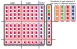
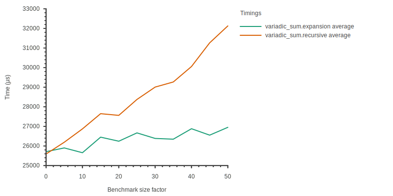
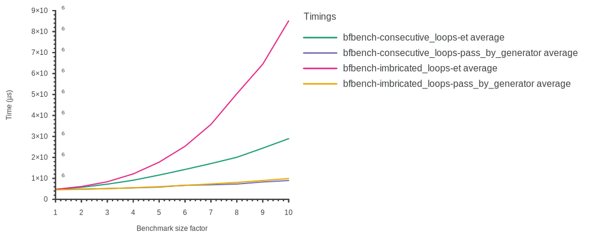
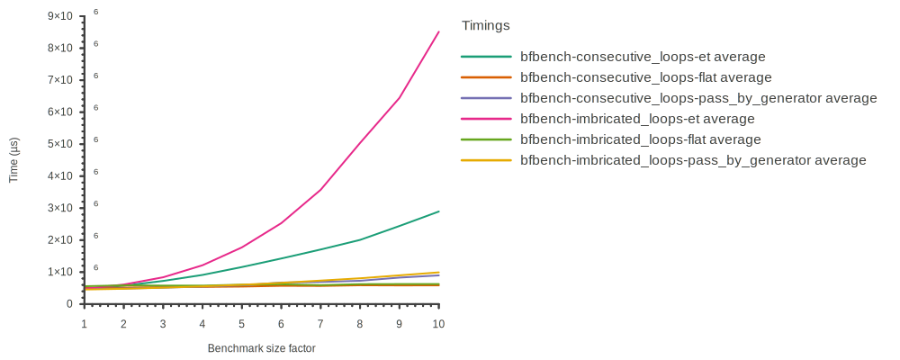

<!-- paginate: skip -->

<br/>
<br/>

# Techniques avancées de génération de code pour la performance

<br/>

> Jules Pénuchot

<br/>

**Université Paris-Saclay**
*Equipe ParSys*

Thèse sous la direction de *Joël Falcou*
Soutenue le 24/09/2024 à l'Université Paris-Saclay

---
<!-- paginate: true -->

## Le HPC: un paysage de plus en plus complexe

<br/>

**Le matériel:**

- Plus de *parallélisme(s)*: CPUs multi-coeurs, SIMD, GPUs
  Exemples: AMD EPYC (192 coeurs), Fujitsu A64FX

- Plus de *spécialisation*: TPU, FPGA
  Exemples: Cerebras WSE-3
<!-- TODO: Trouver un modele de FPGGA -->

**Les bibliothèques et applications:**

- Des domaines de plus en plus *diversifiés*
- Une compatibilité de plus en plus *large* (ARM, x86, RISC-V...)

*Comment assurer la portabilité et la pérennité du code haute performance?*

---

## Le millefeuille d'abstractions du HPC en C++

<br/>


<!-- https://ivanceras.github.io/svgbob-editor/

.--------------------------.
| "Haut niveau: Intention" |
'--------------------------'

  ^ "Bibliothèques expressives, DSELs: Blaze, Eigen..."
  |
  | "Bibliothèques HPC: BLAS, CUBS, cuDNN, EVE, Thrust, LAPACK..."
  |
  | "Primitives, extensions, APIs: Fonctions intrinsèques, noyaux GPU, OpenMP..."
  |
  v "Instructions CPU/GPU: ARM, x86, RISC-V, PTX..."

.------------------------.
| "Bas niveau: Matériel" |
'------------------------'
-->

---

## Concilier abstraction et performance

<!-- TODO: Revenir dessus -->

- Il faut des abstractionspour gérer la complexité
- Il faut qu'elles soient performantes

-> Il faut faire de la metaprog

---

## La métaprogrammation pour la performance

- **Métaprogramme:** programme prenant du code en entrée ou en sortie.

  - Existe: en LISP, en C, en Rust, en D, etc.


- En C++, les bibliothèques HPC utilisent très majoritairement
  la *métaprogrammation de templates*

  - **Intérêt:** évaluation partielle, composabilité, nouvelles abstractions
  - **Exemples:** Thrust, CUBS, EVE, HPX
<br/>

*Peut-on aller plus haut en niveau d'abstraction ?*
**Oui, via les Domain Specific Embedded Languages**

---

## Les Domain Specific Embedded Languages (DSELs)

- En C++, les langages dédiés sont basés sur la **surcharge d'opérateurs**,
  utilisant des **expression templates** pour la génération de code.

- **Expression templates:** représentation d'expressions algébriques
  sous forme d'arborescences de templates de types.

<!-- TODO: verifier que ca compile + modifier le type -->
*Exemple: Blaze*
```c++
#include <blaze/Blaze.h>

int main() {
  blaze::DynamicMatrix<int> mat_a({{4, -2, 5}}), mat_b({{2}, {5}, {-3}});

  // Add<DynamicMatrix<int>, Trans<DynamicMatrix<int>>>
  auto expr = mat_a + trans(mat_b);

  blaze::DynamicMatrix<int> mat_c = expr; // Génération de code à l'assignation
}
```

---

## Problématiques des DSEL pour le HPC

<!-- TODO: Retirer ce slide? -->

<!--Encore plus loin:
**C**ompile-**T**ime **R**egular **E**xpressions *(CTRE)*, Hana Dusíková
*DSEL ne reposant pas sur la syntaxe C++ (hors HPC)*-->

<br/>
<br/>


- Temps de compilation

- Difficulté de la métaprogrammation de templates

- DSELs limités à la syntaxe C++

---

## Problématiques des DSEL pour le HPC

<!--Encore plus loin:
**C**ompile-**T**ime **R**egular **E**xpressions *(CTRE)*, Hana Dusíková
*DSEL ne reposant pas sur la syntaxe C++ (hors HPC)*-->

<br/>
<br/>

- Temps de compilation
  *Quels outils pour analyser les temps de compilation?*

- Difficulté de la métaprogrammation de templates
  *Faut-il abstraire la métaprogrammation?*

- DSELs limités à la syntaxe C++
  *Quel intérêt pour le HPC ?*

---

# Les travaux de cette thèse

<br/>

- **Portabilité des bibliothèques HPC "classiques"**

  - Génération de noyaux de calcul SIMD

- **Analyse des temps de compilation**

  - Nouvelle méthode de benchmarking pour les métaprogrammes

- **Techniques d'implémentation des DSELs**

  - Nouvelles méthodes pour leur implémentation
  - DSEL arbitraires appliqués au HPC

---

<!-----

# Contexte: pourquoi C++ ?

C++ est la plateforme de choix pour le calcul haute performance
*et la métaprogrammation*

**Langages GPGPU**

- CUDA, SYCL, et HIP sont basés sur C++

**Bibliothèques HPC**

- Parllélisme: OpenMP, HPX, BLAS, FFTW
- Squelettes algorithmiques: Thrust, rocThrust

**Bibliothèques génératives**

- CTRE, Eigen, Blaze, EVE, xSIMD, CTPG

---

C++ permet de plus en plus d'évaluation partielle **à la compilation**

C++98: templates
C++11: parameter packs

Ouvre le champ pour la métaprogrammation de templates

---

C'est utilisé pour générer du code optimisé à la compilation

gemv, expression templates

----->

## Génération de noyaux de calcul SIMD

<br/>

- **Ge**neral **M**atrix-**V**ector multiply *(GEMV)*
  *matrice column-major*

  - Implémentée en **assembleur** dans OpenBLAS

  - Optimisée manuellement pour **chaque architecture**

  - Le coût des abstractions est **critique**
<br/>

**Est-il possible de générer ce code au lieu de le réimplémenter
pour chaque architecture?**

---

### Génération de noyaux GEMV performants

- **Deux techniques pour son optimisation:**
  - Utilisation des instructions vectorielles
  - Déroulage des boucles pour exploiter le pipelining des instructions

- **Générer du code quelle que soit l'architecture**

  - Exploiter les architectures SIMD de manière portable,
    et dont la taille est connue à la compilation
    *boost.simd/EVE*

  - Automatiser le déroulage
    *déroulage automatique par template metaprogramming*

---

### Optimisation de GEMV


*3 étapes en SIMD: Broadcast, produit, réduction*

---

### Implémentation générique de GEMV

```cpp
template <typename T, std::size_t M, std::size_t N>
void gemv(mat<T, M, N> &mat, vec<T, N> &vec, vec<T, N> &r) {
  constexpr auto Size = eve::wide<T>::static_size;
  constexpr auto SIMD_M = eve::align(M, eve::under{Size});
  constexpr auto SIMD_N = eve::align(N, eve::under{Size});

  for_constexpr<0, SIMD_N,Size>([](auto j) {
    eve::wide<T> pvec(&vec[j]), mulp_arr[Size];
    for_constexpr<0, Size>(
        [&](auto idx) { mulp_arr[idx] = eve::broadcast<idx>(pvec); });

    for_constexpr<0, SIMD_M>([&](auto I) {
      eve::wide<T> resp(&res[i + (I * Size)]);

      for_constexpr<0, Size>([&](auto J) {
        eve::wide<T> matp(&mat(i + (I * Size), j + J));
        resp = eve::fma(matp, mulp_arr[J], resp);
        eve::store(resp, &r[i + (I * Size)]);
      });
    } // Scalar code follows ...
}
```

---


*Code généré vs OpenBLAS - x86 (Intel i5-7200)*

---


*Code généré vs OpenBLAS - ARM (ARM Cortex A57)*

---

### GEMV: conclusions


- Grace à la métaprogrammation:

  - Les performances des noyaux générés sont **très bonnes**
  - Le code est **compact**
  - Le code est **portable**

- Mais...

  - Les temps de compilation sont **plus longs**

<br/>

**Quels outils pour les analyser ?**

---

# Les travaux de cette thèse

<br/>
<br/>

- **Portabilité des bibliothèques HPC "classiques"**

- **Analyse des temps de compilation**

  - Nouvelle méthode de benchmarking pour les métaprogrammes

- **Techniques d'implémentation des DSELs**

---

## L'évaluation directe de code C++ à la compilation

- Croissance du support et de l'utilisation de la métaprogrammation:

  - *C++98:* templates récursifs
  - *C++11:* parameter pack, constexpr
  - *C++17:* if constexpr
  - *C++20:* concepts, alloc constexpr, std::vector, std::string
  - *C++23:* std::unique_ptr

- Temps de **compilation** vs temps de **développement** vs temps **d'exécution**

- **Comment comparer l'efficacité des techniques de métaprogrammation?**
Exemple: *if constexpr* vs *SFINAE* vs *concepts*

- **Besoin d'outils d'analyse des temps de compilation**

---

## ctbench - github.com/jpenuchot/ctbench

- **Objectif:** Analyse des temps de compilation via le profiler de Clang

- **Orienté C++:** API CMake, configuration JSON, bibliothèque C++,
utilisation du préprocesseur pour les benchmarks

- **Fonctionnalités:**

  - Permet de **filtrer, agréger, et analyser les évènements de compilation**
    de manière configurable, puis de tracer des courbes

  - Génère des graphes dans plusieurs formats: SVG, PNG, etc.

  - S'adapte à d'autres compilateurs *(mesure des temps d'exécution)*

---

### Cas d'usage de ctbench

- Entiers sous forme de types

```cpp
template <std::size_t N> struct ct_uint_t {
  static constexpr std::size_t value = N;
};
```

- Addition d'un pack d'entiers

```cpp
constexpr auto foo() {
  return []<std::size_t... Is>(std::index_sequence<Is...>) {
    return sum(ct_uint_t<Is>{}...);
  }
  (std::make_index_sequence<BENCHMARK_SIZE>{});
}

constexpr std::size_t result = decltype(foo())::value;
```

---

### Cas d'usage de ctbench

- **1e implémentation:** récursion
```cpp
template<typename ... Ts> constexpr auto sum();
template <> constexpr auto sum() { return ct_uint_t<0>{}; }
template <typename T> constexpr auto sum(T const &) { return T{}; }

template <typename T, typename... Ts>
constexpr auto sum(T const &, Ts const &...tl) {
  return ct_uint_t<T::value + decltype(sum(tl...))::value>{};
}
```

- **2e implémentation:** expansion de parameter pack

```cpp
template<typename ... Ts> constexpr auto sum();
template <> constexpr auto sum() { return ct_uint_t<0>{}; }

template <typename... Ts> constexpr auto sum(Ts const &...) {
  return ct_uint_t<(Ts::value + ... + 0)>{};
}
```

---


*Comparaison du temps de compilation, récursion vs parameter pack*

---

## Conclusion sur ctbench

<!-- TODO: Finir cette conclusion -->

- On dispose d'un outil plus complet

- On peut chercher des metaprogrammes plus complexes: des DSELs arbitraires

- Cet outil peut nous guider dans leur implémentation

  - Estimation globale de l'impact sur le temps de compilation
  - Comparaison des techniques de métaprogrammation

---

# Les travaux de cette thèse

<br/>
<br/>

- **Portabilité des bibliothèques HPC "classiques"**

- **Analyse des temps de compilation**

- **Techniques d'implémentation des DSELs**

  - Nouvelles méthodes pour leur implémentation
  - DSEL arbitraires appliqués au HPC

---

## Etat de l'art des DSEL

- **Pour le HPC:** Eigen (2009), Blaze (2012), NT2 (2014)

```c++
#include <blaze/Blaze.h>

int main() {
  blaze::DynamicMatrix<int> mat_a({{4, -2, 5}}), mat_b({{2}, {5}, {-3}});
  auto expr = mat_a + trans(mat_b);
  blaze::DynamicMatrix<int> mat_c = expr;
}
```

- **Problème:** la syntaxe C++ limite la syntaxe des DSELs pour le HPC

- **Est-il possible de s'affranchir de la syntaxe C++?**

---

## Compile Time Regular Expressions (CTRE)

*Hana Dusíková, 2018*
https://github.com/hanickadot/compile-time-regular-expressions

Analyse d'expressions régulières PCRE et transformation en fonctions C++

```cpp
std::optional<std::string_view> extract_number(std::string_view s) noexcept {
  if (auto m = ctre::match<"[a-z]+([0-9]+)">(s)) {
    return m.get<1>().to_view();
  } else {
    return std::nullopt;
  }
}
```

CTRE utilise un **parser d'expressions PCRE** à la compilation

- **Quelles techniques pour généraliser cette idée ?**

- **Peut-on appliquer cette technique aux DSELs pour le HPC ?**

---

### Vers des compilateurs embarqués

- Rappel des nouveautés constexpr

  - Allocation dynamique
  - Support de la bibliothèque standard (std::vector, std::unique_ptr...)

```cpp
constexpr std::vector<int> foo() { return {0, 1, 2, 3}; }
```

**Idée:** peut-on adapter un parser runtime quelconque pour le compile-time ?

- Mémoire dynamique dans les **fonctions constexpr**,
  mais pas dans les **paramètres de templates**

```cpp
template <auto Value> struct my_type {};
my_type<foo()> my_value; // ERREUR
```

*Comment contourner cette contrainte ?*

---

### Le langage Brainfuck

| Token   | Sémantique            | Token   | Sémantique            |
|---------|-----------------------|---------|-----------------------|
| **>**   | `ptr++;`              | **<**   | `ptr--;`              |
| **+**   | `++(*ptr);`           | **-**   | `--(*ptr);`           |
| **.**   | `putchar(*ptr);`      | **,**   | `(*ptr) = getchar();` |
| **[**   | `while(*ptr) {`       | **]**   | `}`                   |

- **Propriétés du langage:**
  - 1 token = un noeud d'AST
  - Langage structuré

- *hello-world.bf*
```
++++++++[>++++[>++>+++>+++>+<<<<-]>+>+>->>+[<]<-]
>>.>---.+++++++..+++.>>.<-.<.+++.------.--------.>>+.>++.
```

---

### Un parser Brainfuck constexpr

```cpp
constexpr std::tuple<ast_block_t, token_vec_t::const_iterator>
parse_block(token_vec_t::const_iterator parse_begin,
            token_vec_t::const_iterator parse_end) {
  std::vector<ast_node_ptr_t> block_content;
  for (; parse_begin != parse_end; parse_begin++) {
    if (*parse_begin == while_end_v) {
      return {std::move(block_content), parse_begin};
    } else if (*parse_begin == while_begin_v) {
      auto [while_block_content, while_block_end] =
          parse_block(parse_begin + 1, parse_end);
      block_content.push_back(
          std::make_unique<ast_while_t>(std::move(while_block_content)));
      parse_begin = while_block_end;
    } else if (*parse_begin != nop_v) {
      block_content.push_back(
          ast_node_ptr_t(std::make_unique<ast_token_t>(*parse_begin)));
    }
  }
  return {ast_block_t(std::move(block_content)), parse_end};
}
```

---

### Génération de programmes Brainfuck

- Intuitivement, on souhaite construire des expression templates.

  - *Comment passer la mémoire dynamique en paramètre de templates ?*

  - On passe pas les noeuds, on passe leurs **fonctions génératrices**

```cpp
constexpr std::vector<int> foo() { {0, 1, 2, 3}; }

template <auto Value> struct my_type {};

// my_type<foo()> my_value; // ERREUR
my_type<foo> my_value;      // OK
```

- Visite de l'AST en passant récursivement les génératrices des sous-noeuds

  - Fonction de parsing appelée **autant de fois qu'il y a de noeuds**

  - **Quel est l'impact sur les performances ?**

---

*Temps de compilation en secondes*

| Backend                   | Hello World | Hello World x2  | Mandelbrot |
|-|-|-|-|
| **Noeuds d'AST**          | *106* | *212* | *11672*           |
| Avec expression templates | 19.18 | 74.51 | Failure (timeout) |
| Sans expression templates | 3.55  | 12.73 | Failure (timeout) |



---

### Une alternative au passage par génératrice

```c++
constexpr std::vector<int> foo() { return {0, 1, 2, 3}; }
template <auto Value> struct my_type {};

constexpr auto foo_arr() {
  std::array<int, foo().size()> array;
  std::ranges::copy(foo(), array.begin());
  return array;
}

my_type<foo_arr()> my_value; // OK
```

- On ne peut pas passer **la mémoire**

- On peut passer **les valeurs**

- `foo()` n'est appelée que 2 fois

- **Pour passer un AST en paramètre de template, il suffit de le sérialiser**

---

| Backend | Hello World | Hello World x2  | Mandelbrot |
|-|-|-|-|
| **Noeuds d'AST**  | *106* | *212* | *11672*           |
| Gen. avec ET      | 19.18 | 74.51 | Failure (timeout) |
| Gen. sans ET      | 3.55  | 12.73 | Failure (timeout) |
| Serialisation     | 0.63  | 0.80  | 18.16             |



---

## Application pour le calcul numérique

- **Parser:** algorithme Shunting-Yard (Dijkstra, 1961)
  - Interprétation triviale

  - Précédence et associativité des opérateurs

  - Sortie en **notation postfix**
    *Exemple: 2 + 3 -> 2 3 +*

- **Langage mathématique simple:** Tiny Math Language

```cpp
static constexpr auto formula = "sin((x + 3) / 3 * y ^ 2)";
blaze::DynamicVector<float> vector_x(16, 1.), vector_y(16, 12.);

auto function = tml::codegen<formula>();
blaze::DynamicVector<float> result = function(vector_x, vector_y);
```

---

Implem constexpr: parser ordinaire + generateur de code a base de lecture RPN

---

## poacher - github.com/jpenuchot/poacher

Projet expérimental pour l'implémentation de parsers **constexpr**,
et de **générateurs de code** associés

- Un langage simple pour **explorer les techniques de génération**
- Un langage mathématique comme **application HPC**
- Des **benchmarks reproductibles** via ctbench

On a des nouvelles techniques pour écrire des métaprogrammes
avec du C++ régulier

Plusieurs méthodes:

- Pass-by-generator: prototypage et petits DSELs
- Sérialisation vers NTTP: langages complexes
- Fonctionnent pour le calcul hautes performances

Nouvelle méthodologie pour le benchmarking des temps de compilation

---

# Les publications

- "ctbench - compile-time benchmarking and analysis", 2023
  Jules Pénuchot, Joël Falcou
  Journal of Open Source Software

<!--
@article{Penuchot2023,
  doi = {10.21105/joss.05165},
  url = {https://doi.org/10.21105/joss.05165},
  year = {2023},
  publisher = {The Open Journal},
  volume = {8},
  number = {88},
  pages = {5165},
  author = {Jules Penuchot and Joel Falcou},
  title = {ctbench - compile-time benchmarking and analysis},
  journal = {Journal of Open Source Software},
}

@inproceedings{hpcs2018-matvec,
  author = {Penuchot, Jules and Falcou, Joel and Khabou, Amal},
  booktitle = {2018 International Conference on High Performance Computing
               Simulation (HPCS)},
  title = {Modern Generative Programming for Optimizing Small Matrix-Vector
           Multiplication},
  year = {2018},
  volume = {},
  number = {},
  pages = {508-514},
  doi = {10.1109/HPCS.2018.00086},
}

@online{ctbench-cppp21,
  author = {Jules {Penuchot}},
  title = {ctbench: compile time benchmarking for Clang},
  year = {2021},
  url = {https://www.youtube.com/watch?v=1RZY6skM0Rc},
}


@online{meetingcpp22,
  author = {Paul {Keir} and Joel {Falcou} and Jules {Penuchot} and Andrew {
            Gozillon}},
  title = {Meeting C++ - A totally constexpr standard library},
  year = {2022},
  url = {https://www.youtube.com/watch?v=ekFPm7e__vI},
}
-->

---


Conclusion - 5mn:

Benchmarking:

- Il faut encore plus d'outils
