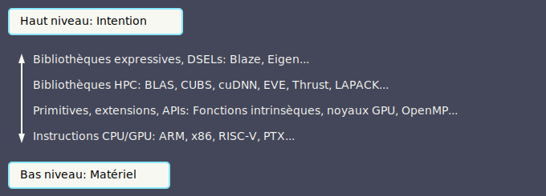

<!-- paginate: skip -->

# Jules Pénuchot

<br/>
<br/>
<br/>

> Techniques avancées de génération de code pour la performance

<br/>

**Université Paris-Saclay**
*Equipe ParSys*

Thèse sous la direction de *Joël Falcou*

---
<!-- paginate: true -->

## Plan de la présentation

**Introduction**

- Calcul haute performance
- Les bibliothèques de calcul haute performance en C++
- Métaprogrammation et langages dédiés pour le HPC

**Travaux effectués**

- Génération de noyaux de calcul SIMD
- Langages dédiés arbitraires en C++ et application pour le HPC
- Mesure et analyse des temps de compilation

**Discussion**

- Outils pour le parsing et la génération de code
- Evolutions du langage C++

---

# Le calcul haute performance
<!-- 10mn -->

<br/>

**H**igh-**P**erformance **C**omputing *(HPC)*

<br/>

- **Matériel performant**
  *processeurs multi-coeurs, SIMD, GPUs*


- **Abstractions performantes**
  *langages, APIs, bibliothèques*

<!-- "Abstractions performantes": qui ne pénalisent pas le temps d'exécution -->

---

## Le millefeuille d'abstractions du HPC

<br/>


<!-- https://ivanceras.github.io/svgbob-editor/

.--------------------------.
| "Haut niveau: Intention" |
'--------------------------'

  ^ "Bibliothèques expressives, DSELs: Blaze, Eigen..."
  |
  | "Bibliothèques HPC: BLAS, CUBS, cuDNN, EVE, Thrust, LAPACK, OpenMP..."
  |
  | "Primitives et APIs: Fonctions intrinsèques, noyaux GPU, appels système..."
  |
  v "Instructions CPU/GPU: ARM, x86, RISC-V, PTX..."

.------------------------.
| "Bas niveau: Matériel" |
'------------------------'
-->

---

## Un paysage de plus en plus complexe

<br/>

**Le matériel:**

- Plus de *parallélisme(s)*
- Plus de *spécialisation*

*Exemples récents:* Fujitsu A64FX, Cerebras WSE-3

**Les bibliothèques et applications:**

- Des domaines de plus en plus *diversifiés*

*Quelles abstractions pour s'adapter à l'évolution du matériel?*
*Comment assurer la portabilité et la pérennité du code haute performance?*

---

## La génération de code pour la performance

<br/>

**Métaprogramme:** programme prenant du code en entrée ou en sortie.

En C++, les bibliothèques HPC utilisent très majoritairement
la *métaprogrammation de templates*
<br/>

- **Intérêt:** évaluation partielle, composabilité, nouvelles abstractions
- **Exemples:** Thrust, CUBS, EVE
<br/>

Peut-on aller plus loin ?
*Oui.*

---

## Les langages dédiés pour le calcul haute performance en C++

**D**omain **S**pecific **E**mbedded **L**anguage *(DSEL)*
<br/>

*Bibliothèques de référence: Blaze et Eigen*

Langages dédiés basés sur de la **surcharge d'opérateurs**,
utilisant des **expression templates** pour la génération de code.

**Expression templates:** représentation d'expressions algébriques
sous forme d'arborescences de templates de types.
<br/>

```c++
blaze::DynamicVector<int> vec_a({4, -2, 5}), vec_b({2, 5, -3});

auto expr = vec_a + vec_b; // Add<DynamicVector<int>, DynamicVector<int>>
blaze::DynamicVector<int> vec_c = expr; // Génération de code à l'assignation
```

---

## Les langages dédiés pour le calcul haute performance en C++

**Problèmes:** difficulté d'implémentation et temps de compilation

*Quelles techniques permettraient de résoudre ces problèmes ?*
*Quel intérêt pour le HPC ?*


- Héritent des problématiques associées aux métaprogrammes de templates
- DSELs limités à la syntaxe C++ (sauf ctre)

---

## Performances: les bibliothèques "métier"

Expressivité, que faire ?

Blaze, Eigen... et au-dela ?


Comment je peux avoir des formules en LaTeX math ou d'autres langages
**dans C++** (si c'est possible/raisonnable)..?

<!-----

# Contexte: pourquoi C++ ?

C++ est la plateforme de choix pour le calcul haute performance
*et la métaprogrammation*

**Langages GPGPU**

- CUDA, SYCL, et HIP sont basés sur C++

**Bibliothèques HPC**

- Parllélisme: OpenMP, HPX, BLAS, FFTW
- Squelettes algorithmiques: Thrust, rocThrust

**Bibliothèques génératives**

- CTRE, Eigen, Blaze, EVE, xSIMD, CTPG

---

C++ permet de plus en plus d'évaluation partielle **à la compilation**

C++98: templates
C++11: parameter packs

Ouvre le champ pour la métaprogrammation de templates

---

C'est utilisé pour générer du code optimisé à la compilation

gemv, expression templates

----->

## GEMV

SIMD auto
déroulage auto

---

## L'évaluation directe de code C++ à la compilation

Historique:

* C++11: constexpr
* C++17: if constexpr
* C++20: alloc constexpr, std::vector, std::string
* C++23: std::unique_ptr
* C23: `#embed`

---

## Etat de l'art des DSEL

Parsing compile-time, mais avec quel niveau de passage à l'échelle?
*(performances et maintenabilité)*

#### CTRE

- Template metaprogramming

- Performances raisonnables pour des cas de petite taille (Regex)

- Maintenabilité limitée (requiert des connaissances en TMP)

<br/>

-> **La programmation constexpr peut-elle apporter du mieux ?**

---

# Contribution
<!-- 20mn -->

<br/>

## poacher

DSELs implémentés en C++ via la **métaprogrammation constexpr** pour le parsing, avec une représentation de code dynamique *(std::unique_ptr)*

<br/>

## ctbench

Méthodologie et outils pour la mesure de **temps de compilation** des métaprogrammes, avec les *données de profiling de Clang*

---

## poacher

Comment exploiter la programmation constexpr pour implémenter des DSELs ?

Contraintes sur la mémoire dynamique

Faire le pont entre la programmation constexpr et les templates

Minimiser la métaprogrammation de templates

Deux langages: Brainfuck, et Tiny Math Language (TML)

---

## poacher - un exemple simple pour commencer: Brainfuck

| Token | Sémantique            |
|-------|-----------------------|
| `>`   | `ptr++;`              |
| `<`   | `ptr--;`              |
| `+`   | `++(*ptr);`           |
| `-`   | `--(*ptr);`           |
| `.`   | `putchar(*ptr);`      |
| `,`   | `(*ptr) = getchar();` |
| `[`   | `while(*ptr) {`       |
| `]`   | `}`                   |

* 1 token = un noeud d'AST
* Parsing trivial
* Langage structuré
* Turing complet

---

## poacher - le parser Brainfuck

C++ ordinaire
On rajoute constexpr partout
On fait une AST classique avec std::unique_ptr

-> C'est plié

---

## poacher - premier backend de génération de code

Vieux réflexe: on génère des expression templates

Problématique: comment transformer des structures qui ne passent pas en NTTP (car elles pointent vers de la mémoire dynamique) en arborescences de types?

On passe pas la mémoire, on passe des lambdas qui génèrent chaque noeud:

```
constexpr std::vector<std::vector<int>> get_vector() {
  return {{1, 2, 3}, {4, 5, 6}};
}

// Pas bien:
// constexpr std::vector<int> subvec_0 = get_vector()[0];

// Bien:
constexpr auto get_subvec_0 = []() { return get_vector()[0]; }
```

---

Perfs ???

On peut compiler Hello World (106 noeuds):

```
++++++++[>++++[>++>+++>+++>+<<<<-]>+>+>->>+[<]<-]
>>.>---.+++++++..+++.>>.<-.<.+++.------.--------.>>+.>++.
```

On ne peut pas compiler Mandelbrot (~11'000 noeuds)

Problème: comment mesurer efficacement les temps de compilation

---

## ctbench

Mesure de temps de compilation via le profiler de Clang

Orienté C++: API CMake, configuration JSON, bibliothèque C++

Génère des graphes dans plusieurs formats: SVG, PNG, etc.

S'adapte à d'autres compilateurs *(mesure de temps d'exécution)*

Permet de **filtrer, agréger, et analyser les évènements de compilation**
de manière configurable, puis de tracer des courbes

---

## ctbench - exemple simple

https://github.com/jpenuchot/ctbench

- Entiers sous forme de types

```cpp
template <std::size_t N> struct ct_uint_t {
  static constexpr std::size_t value = N;
};
```

- Addition d'un pack d'entiers

```cpp
constexpr auto foo() {
  return []<std::size_t... Is>(std::index_sequence<Is...>) {
    return sum(ct_uint_t<Is>{}...);
  }
  (std::make_index_sequence<BENCHMARK_SIZE>{});
}

constexpr std::size_t result = decltype(foo())::value;
```

---

- Récursion
```cpp
template<typename ... Ts> constexpr auto sum();

template <> constexpr auto sum() { return ct_uint_t<0>{}; }
template <typename T> constexpr auto sum(T const &) { return T{}; }

template <typename T, typename... Ts>
constexpr auto sum(T const &, Ts const &...tl) {
  return ct_uint_t<T::value + decltype(sum(tl...))::value>{};
}
```

- Expansion de parameter pack

```cpp
template<typename ... Ts> constexpr auto sum();

template <> constexpr auto sum() { return ct_uint_t<0>{}; }

template <typename... Ts> constexpr auto sum(Ts const &...) {
  return ct_uint_t<(Ts::value + ... + 0)>{};
}
```

---


---

BF - 3e tentative

---

## TML

---

RPN & Shunting Yard

---

Implem constexpr: parser ordinaire + generateur de code a base de lecture RPN

---

Conclusion - 5mn:

On a des nouvelles techniques pour écrire des métaprogrammes
avec du C++ régulier

Plusieurs méthodes:

- Pass-by-generator: prototypage et petits DSELs
- Sérialisation vers NTTP: langages complexes
- Fonctionnent pour le calcul hautes performances

Nouvelle méthodologie pour le benchmarking des temps de compilation
